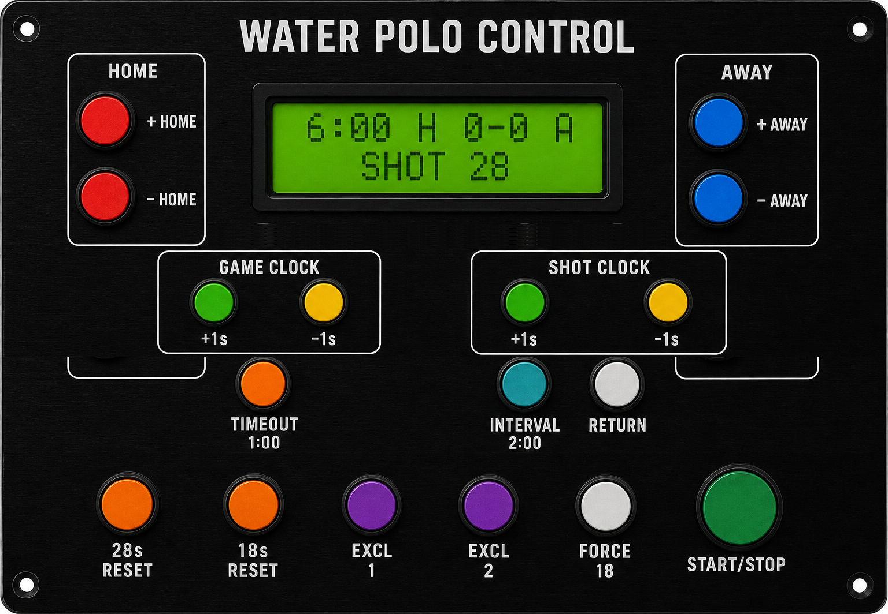
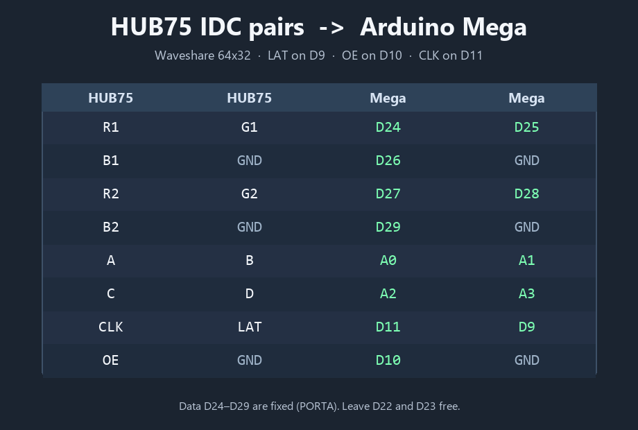

# Build Plan: Water Polo Scoreboard (Arduino Mega)

Use this document as the **full specification and agent prompt** for building (or regenerating) the Water Polo Scoreboard project. Follow it end-to-end. If you tweak timing constants, pin numbers, or UI copy, keep behavior, file layout, and documentation structure the same so re-runs produce a similar project.

---

## Goal

Build an **operator scoreboard** for water polo on an **Arduino Mega 2560** that provides:

1. A **period clock** (default **6:30**)
2. **Home / Away** scores (0–99)
3. A **28-second shot clock** (with an 18 s partial reset)
4. **Timeout (1:00)** and **Interval (2:00)** modes
5. Two **18 s exclusion** timers
6. Local displays: **Waveshare 64×32 RGB HUB75 matrix** + **Freenove I2C 16×2 LCD**
7. A **5 V relay** horn/alarm on shot/period/TO expiry
8. **LoRa UART** broadcast of shot-clock values to remote shot clocks (`lora_remote2` protocol)

---

## Required deliverables (must create all)

Create **all** of the following files. Do not stop after the sketch alone.

### 1. Main Arduino sketch (INO)

**Path (required):**

```text
waterpolo_scoreboard/waterpolo_scoreboard.ino
```

Arduino IDE requires the folder name to match the `.ino` basename.

### 2. Project README

**Path (required):**

```text
README.md
```

Contents must cover: parts list, feature summary / pin→action table, libraries, **full Mega pin map**, wiring diagrams (ASCII + references to `docs/` images if present), build & upload steps, first-run checks, display layouts, LoRa protocol notes, Freenove LCD notes, and a pointer to the hardware test sketch.

### 3. Operator usage guide

**Path (required):**

```text
USAGE.md
```

Write this as a **standalone operator guide** for someone running a game from the button box + LCD. Assume they do **not** need wiring or pin numbers — use panel labels (`START/STOP`, `+ HOME`, `28s RESET`, etc.). Include:

- What the LCD / matrix show
- Start/stop, scoring, shot clock, timeouts/intervals, exclusions
- Fine adjust (±1 / long ±10)
- Full game reset (combo hold)
- Typical period workflow
- Button quick-reference table

Also keep a condensed **How to use** section in `README.md` that either mirrors the guide or clearly links to `USAGE.md` (preferred: full operator content in `USAGE.md`, short summary + link in `README.md`).

### 4. Optional but recommended hardware smoke test

**Path:**

```text
test_d2_lcd/test_d2_lcd.ino
```

Minimal Mega sketch: D2 button (INPUT_PULLUP to GND) + Freenove I2C LCD on SDA/SCL (D20/D21). LCD shows `D2 + I2C LCD OK` and toggles `BTN: PRESSED` / `BTN: released` with a press counter.

### 5. Docs assets (if regenerating docs)

If regenerating documentation images, place under `docs/`:

- `docs/button_box_panel.png` — operator panel layout
- `docs/rgb_matrix_mega_wiring.png` — HUB75 → Mega wiring

If images already exist, **reuse them** and reference them from README/USAGE. Do not delete them.

---

## Hardware (do not substitute without documenting)

| Qty | Part | Notes |
|----:|------|-------|
| 1 | Arduino Mega 2560 | Required — Uno lacks pins |
| 1 | Waveshare RGB LED matrix 64×32 P3 | SKU **33840**, HUB75 |
| 1 | 5 V PSU for matrix | **≥ 2.5 A**, VH4 |
| 1 | Freenove I2C IIC LCD 1602 | I2C backpack onboard |
| 17 | Momentary push-buttons | Active LOW → GND, Mega INPUT_PULLUP |
| 1 | 5 V relay module | Driven by **D12** |
| 1 | LoRa UART module (TX) | e.g. DX-LR02 / DX-LR32 433 MHz |
| 1+ | LoRa remote shot clocks | Firmware `lora_remote2` |

**Power rules:**

- Matrix power from **external 5 V** on VH4 — never Mega 5 V.
- Common GND across PSU, Mega, matrix, LCD, LoRa, button commons.
- Configurable `RELAY_ACTIVE_HIGH` (default `true`).

---

## Libraries & board

Arduino Library Manager:

1. **Adafruit GFX Library**
2. **RGB matrix Panel** (Adafruit)
3. **LiquidCrystal I2C** (Frank de Brabander or Freenove zip)

**Board:** Arduino Mega or Mega 2560.

I2C LCD: try address **0x27**, fall back to **0x3F**.

---

## Exact pin map (must match)

### Buttons (INPUT_PULLUP, other side → GND)

| Pin | Function |
|----:|----------|
| D2 | Period start/stop |
| D3 | Home + |
| D4 | Away + |
| D5 | Home − |
| D6 | Away − |
| D7 | Shot → 28 |
| D8 | Shot → 18 **if** current &lt; 18 |
| D36 | Period +1 s (long +10) |
| D37 | Period −1 s (long −10) |
| D38 | Shot +1 s (long +10) |
| D39 | Shot −1 s (long −10) |
| D40 | Timeout 1:00 |
| D41 | Interval 2:00 |
| D42 | Force shot → 18 (always) |
| D43 | RETURN — end TO/IN early |
| D47 | Exclusion 1 → 18 s |
| D48 | Exclusion 2 → 18 s |

### Outputs / buses

| Pin | Function |
|----:|----------|
| D12 | Relay IN |
| D18 / D19 | Serial1 TX1 / RX1 → LoRa |
| D20 / D21 | I2C SDA / SCL → LCD |
| D9 / D10 / D11 | Matrix OE / LAT / CLK |
| D24–D29 | Matrix R1 G1 B1 R2 G2 B2 |
| A0–A3 | Matrix address A B C D |

**Do not use:** D0/D1 (USB serial), D22/D23 (matrix library PORTA).

Matrix constructor pattern:

```cpp
RGBmatrixPanel matrix(A, B, C, D, CLK, LAT, OE, true, 64);
```

---

## Timing & game constants

```text
PERIOD_SECONDS     = 6*60 + 30   // 6:30
SHOT_FULL          = 28
SHOT_PARTIAL       = 18
TIMEOUT_SECONDS    = 60
INTERVAL_SECONDS   = 2*60
EXCLUSION_SECONDS  = 18

DEBOUNCE_MS        = 15
LONG_PRESS_MS      = 5000        // D2 alone from stopped → period reset 6:30
ADJUST_LONG_MS     = 800         // D36–D39 long → ±10 s
COMBO_RESET_MS     = 5000        // D2 + D7 held → full reset

RELAY_SHOT_MS      = 500
RELAY_PERIOD_MS    = 1000
RELAY_TO_MS        = 500

LORA_BAUD          = 9600
LORA_RESEND_MS     = 500
LORA_DEFAULT_CHANNEL = 2         // 433.150 MHz
```

LoRa channel table CH0–3: `433.050 / .100 / .150 / .200` MHz (`AT+FREQ=` on Serial1).

---

## Behavioral specification (implement exactly)

### Modes

Define helpers (required — do not omit):

```cpp
bool inTimeout() { return timeoutLeft > 0; }
bool inInterval() { return intervalLeft > 0; }
bool inPlay()    { return !inTimeout() && !inInterval(); }
```

- **Play:** show period + shot (+ exclusions if active).
- **Timeout:** independent 1:00; period + shot **frozen**; exclusions pause.
- **Interval:** on start, load period **6:30** and shot **28**, clear exclusions; run independent 2:00.

### Period clock (D2)

- Short press in **play** only: toggle running (only start if `secondsLeft > 0`).
- While running: period and shot both count down each second.
- Shot clock runs **only** while period is running in play mode.
- Hold D2 ~5 s from a **stopped** press that did not also hold D7: reset period to 6:30 (do not start).
- During TO/IN, D2 does nothing — use RETURN first.

### Scoring

- Home+/Away+: score +1 (max 99); **stop** period; shot → 28.
- Home−/Away−: score −1 (min 0); clocks unchanged.

### Shot clock

- D7: shot → 28; period keeps running if it was.
- D8: shot → 18 only if `shotLeft < 18`.
- D42: shot → 18 always.
- At shot 0: pulse relay ~0.5 s; LoRa `0` then `BUZZER`; **stop both clocks**; reload shot to 28; send new value.

### Timeout / Interval / Return

- D40: `startTimeout()` — stop clocks, clear interval, set timeout 60.
- D41: `startInterval()` — stop clocks, clear timeout, reset period+shot+exclusions, set interval 120.
- D43: clear TO/IN immediately; after timeout keep shot value; after interval keep fresh 6:30/28.
- When TO or IN hits 0: short relay pulse; return to play display (clocks stopped).

### Exclusions (D47 / D48)

- Start only when that slot is **0** (cannot restart while &gt; 0).
- Set slot to 18; **pause** period clock; apply D8 rule if shot &lt; 18.
- Tick only while period clock is running in play; pause in TO/IN and when stopped.

### Fine adjust (D36–D39)

- Short release: ±1 s; long hold (~0.8 s): ±10 s.
- Do **not** start/stop clocks.
- Period adjust only in play; clamp 0…PERIOD_SECONDS; if period hits 0, stop clock.
- Shot adjust clamp 0…28; send to LoRa on change.

### Full reset

Hold **D2 + D7** together for **5 s**:

- Scores 0–0, period 6:30, shot 28, clear TO/IN/exclusions, clocks stopped.
- Suppress leftover D2 long-press period reset.
- While combo is forming, do not toggle clock / do not apply D7 shot reset.

### Period expiry

When period hits 0: stop clock; relay ~1 s; LoRa `END`.

### Defaults at boot / full reset

Scores **0–0**, period **6:30**, shot **28**, clocks **stopped**.

---

## Software architecture (sketch structure)

Implement in a **single** `.ino` with clear sections:

1. Includes + pin constants + `RELAY_ACTIVE_HIGH`
2. Matrix + LCD init (I2C address probe)
3. LoRa helpers (`forwardToLoRa`, `setLoRaChannel`, `sendShotToLoRa`)
4. Scoreboard state variables
5. Debounced button table (`Btn` struct, 15 ms debounce)
6. Relay pulse service (`relayOffAtMs`)
7. Mode helpers `inTimeout` / `inInterval` / `inPlay`
8. `setShotClock`, `onShotExpired`, `startTimeout`, `startInterval`, `startExclusion`, `fullResetToDefaults`
9. `setup()` / `loop()`
10. `pollButtons` / `onButtonPress` / `onButtonRelease` / long-press + combo services
11. `updateClocks` (1-second tick accumulation via `lastTickMs`)
12. `drawLcd` / `drawMatrix` / `drawAll` / `markDirty`

### `loop()` responsibilities

- Poll buttons frequently (multiple times per loop is fine).
- Update clocks / relay.
- While play + running: re-broadcast shot value to LoRa every **0.5 s**.
- Redraw matrix when dirty, or ~200 ms when blinking at zero.

### Display layouts

**LCD play:**

```text
H:03 A:02 SC:28
5:42* X18/12
```

**LCD TO / IN:**

```text
H:03 A:02 SC:28
TO 0:45
```

```text
H:03 A:02 SC:28
IN 1:30
```

(`*` when period running; exclusion `Xaa/bb` only when at least one active.)

**Matrix play:**

```text
HOME           AWAY
 03             02
5:42  e1 e2    28
```

Colors (Color333):

- Home green `(0,7,0)`, Away orange `(7,2,0)`
- Period white when running, dim when paused, red flash at 0:00
- Shot yellow when running, red at ≤5 s, dim when paused
- Exclusions magenta; only while &gt; 0
- Small running indicator pixel(s) near period time when running
- TO cyan-ish / IN blue-ish on bottom row replacing period+shot

Always `matrix.fillScreen(0)` then draw, then `matrix.swapBuffers(false)`.

---

## LoRa protocol (compatible with `lora_remote2`)

| Item | Value |
|------|--------|
| Link | Serial1 @ 9600 |
| Framing | Newline-terminated text |
| Shot value | Decimal string `28`, `18`, `0`, … |
| Shot expired | `0` then `BUZZER`, then master stops + reloads 28 |
| Period expired | `END` |
| While running | Resend current shot every 0.5 s |
| Channel set | `AT+FREQ=<hz>` at boot for default channel |

---

## README.md outline (required sections)

Write `README.md` with at least these sections, in roughly this order:

1. Title + one-paragraph product summary
2. Parts list (table)
3. What it does (control / pin / action table)
4. Short pointer to **USAGE.md** for operators
5. Libraries + board + I2C addresses
6. Full Arduino Mega pin map (digital + analog, USED / RESERVED / SPARE / AVOID)
7. Wiring diagram (panel layout, HUB75 table, ASCII system overview, relay notes, power rules)
8. Build & upload instructions + first-run checks table
9. Displays (LCD + matrix examples)
10. LoRa protocol
11. Freenove I2C LCD notes
12. Quick hardware test (`test_d2_lcd`)

Include operator panel layout table mapping faceplate positions to pins (as in the current project).

Reference existing images if present:

```markdown


```

---

## USAGE.md outline (required sections)

Write `USAGE.md` as the operator-facing guide:

1. Title + intro (button box + LCD; no wiring needed)
2. Panel layout image reference (if available)
3. What you see (LCD / matrix table)
4. Start / stop the period
5. Scoring
6. Shot clock
7. Timeouts and intervals
8. Exclusions
9. Fine adjust
10. Full game reset
11. Typical period workflow (numbered steps)
12. Button quick reference table (panel labels only)

Mirror the behavioral rules from this plan; keep language non-technical.

---

## Suggested operator panel layout (document + wire)

| Position | Control | Pin |
|----------|---------|-----|
| Top left | Home + / − | D3 / D5 |
| Top right | Away + / − | D4 / D6 |
| Mid left of LCD | Timeout 1:00 | D40 |
| Center | I2C LCD | SDA20 / SCL21 |
| Mid right of LCD | Interval 2:00 · Return | D41 · D43 |
| Under LCD left | Period ±1 s | D36 / D37 |
| Under LCD right | Shot ±1 s | D38 / D39 |
| Bottom L→R | 28 · 18 · Excl1 · Excl2 · Force18 · Start/Stop | D7 · D8 · D47 · D48 · D42 · D2 |

---

## Implementation order (agent checklist)

Execute in this order:

1. **Create folder** `waterpolo_scoreboard/` and write `waterpolo_scoreboard.ino` implementing the full behavioral spec above (including `inPlay` / `inTimeout` / `inInterval`).
2. **Create** `USAGE.md` (operator guide).
3. **Create/update** `README.md` (hardware + wiring + build + link to USAGE).
4. **Create** `test_d2_lcd/test_d2_lcd.ino` smoke test.
5. Keep or reference `docs/*.png` wiring/panel images.
6. Preserve `LICENSE` / `.gitignore` if present; do not invent unrelated apps.
7. Sanity-check the sketch for:
   - All 17 buttons present and mapped
   - Mode helpers defined
   - Combo reset D2+D7
   - LoRa resend while running
   - Relay pulses on shot / period / TO-IN end
   - LCD + matrix layouts match the examples
8. Commit with a clear message describing the scoreboard deliverables.

---

## Non-goals / out of scope

- Do **not** implement the LoRa remote firmware here (reference `lora_remote2` only).
- Do **not** target Arduino Uno / Nano (insufficient pins / wrong PORTA mapping).
- Do **not** drive the matrix from Mega 5 V.
- Do **not** replace HUB75 data pins 24–29 (Adafruit Mega requirement).
- Do **not** omit documentation: INO + README + USAGE are all mandatory.

---

## Acceptance criteria

The build is complete when:

- [ ] `waterpolo_scoreboard/waterpolo_scoreboard.ino` exists and compiles conceptually for Mega 2560 with the three libraries listed
- [ ] All pins, timings, and button behaviors match this plan
- [ ] `README.md` documents parts, pins, wiring, upload, LoRa, displays
- [ ] `USAGE.md` is a standalone operator guide
- [ ] `test_d2_lcd/test_d2_lcd.ino` exists for LCD+D2 bring-up
- [ ] First-run expectations match: LCD `H:00 A:00 SC:28` / `TIME 6:30` (or equivalent period line), matrix HOME/AWAY 00 with `6:30` and `28`

---

## How to re-run / tweak

When re-running an agent against this plan:

1. Paste or attach **this entire `BUILD_PLAN.md`**.
2. State any deltas explicitly at the top, e.g. “Change period to 8:00” or “Add a third exclusion on D49”.
3. Instruct: **Create/overwrite the INO, README.md, and USAGE.md per the plan; preserve docs images unless regenerating.**
4. Expect a similar file tree and behavior; only planned deltas should change.

Example follow-up prompt:

```text
Follow BUILD_PLAN.md exactly.
Tweaks: PERIOD_SECONDS = 8:00; keep everything else identical.
Create waterpolo_scoreboard/waterpolo_scoreboard.ino, README.md, and USAGE.md.
```
