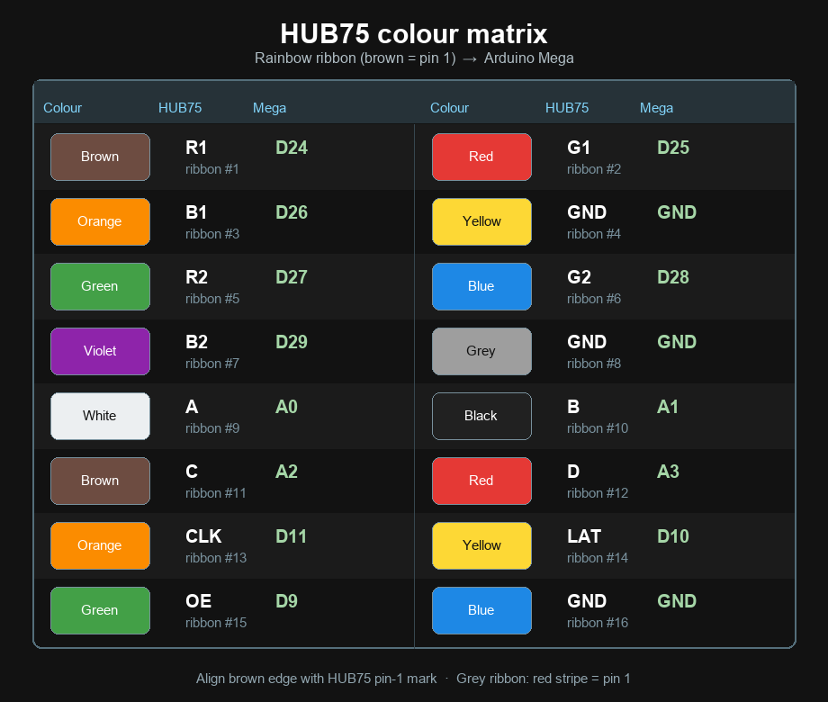

# Water Polo Scoreboard (Arduino Mega)

Operator scoreboard for water polo: **period clock**, **home/away scores**, and a **28 s shot clock**. The shot clock is shown on the local RGB matrix and 16×2 LCD, and is broadcast to external LoRa remote shot clocks (`lora_remote2`).

---

## Parts list

| Qty | Part | Notes / SKU |
|----:|------|-------------|
| 1 | Arduino Mega 2560 (or compatible) | Required — Uno does not have enough pins |
| 1 | Waveshare RGB LED matrix 64×32 P3 | **SKU 33840** — RGB-Matrix-P3-64x32 (HUB75) |
| 1 | 5 V power supply for matrix | **≥ 2.5 A** (Waveshare rating); VH4 connector |
| 1 | HUB75 16-pin IDC ribbon | Usually included with the panel |
| 1 | VH4 2-pin power cable | Usually included with the panel |
| 1 | **Freenove I2C IIC LCD 1602** | Serial 16×2 “New Type” (I2C backpack onboard) |
| 17 | Momentary push-buttons | Score / clock / shot / TO / IN / Return / excl |
| 1 | **5 V relay module** (or 5 V coil + driver) | Driven by **D12**; switches horn / siren / lamp |
| 1 | LoRa UART module (TX side) | e.g. DX-LR02 / DX-LR32 433 MHz class |
| 1+ | LoRa remote shot-clock units | Running `lora_remote2.ino` |
| — | Dupont / jumper wires, breadboard or proto | As needed |
| — | USB cable (A–B) | Mega programming / optional 5 V for MCU only |

**Optional:** level shifter if LoRa module is strictly 3.3 V on UART. For a bare relay coil (no PCB module), use an NPN/MOSFET driver and a flyback diode across the coil — do **not** drive a coil from a Mega pin directly.

---

## What it does

| Control | Pin | Action |
|--------|-----|--------|
| Period start / stop | **D2** | Short press toggles countdown (shot clock follows) |
| Home + | **D3** | Home score +1; **stops** period clock; shot → **28** |
| Away + | **D4** | Away score +1; **stops** period clock; shot → **28** |
| Home − | **D5** | Decrease home |
| Away − | **D6** | Decrease away |
| Shot → 28 | **D7** | Shot→28; period clock **unchanged** (stays running or stopped) |
| Shot → 18 | **D8** | Set shot to 18 if &lt;18; period clock **unchanged** (stays running or stopped) |
| Relay (horn / alarm) | **D12** | Pulses when shot expires (~0.5 s) or period hits 0 (~1 s) |
| Period +1 s | **D36** | Short +1 s · long press **+10 s** (max 8:00) |
| Period −1 s | **D37** | Short −1 s · long press **−30 s** (min 0:00) |
| Shot +1 s | **D38** | Short +1 s · long press **+10 s** (max 28) |
| Shot −1 s | **D39** | Short −1 s · long press **−10 s** (min 0) |
| Timeout 1:00 | **D40** | Pause period + shot; run independent 1:00 timeout |
| Interval 2:00 | **D41** | Advance period (P1→P4); load match period length + shot→28; run **IN** or **HT** break |
| Force shot 18 | **D42** | Set shot clock to 18 s always (ignores &lt;18 rule); **pauses** period clock |
| Return | **D43** | End **TO/IN/HT** early → period+shot (**keeps shot value** after timeout) |
| Exclusion 1 | **D46** | Start 18 s exclusion; **pauses** period clock; applies **D8** if shot &lt;18 |
| Exclusion 2 | **D47** | Same as D46 for second exclusion |

- **D2** short press → start/stop immediately (play mode only)  
- Hold **D2** ~5 s (from stopped) → reset period clock to the **current match length** (default **8:00**)  
- Hold **D2 + D7** together for **5 s** → **full reset** (scores 0–0, period **P1** 8:00, shot 28, clear TO/IN/HT/exclusions, clocks stopped)  
- Shot clock counts **only** while the period clock is running in **play** mode  
- If period remaining is **less than** the shot clock, the shot shows the period seconds (matrix / LCD / LoRa)  
- Value adjust buttons do **not** start/stop the clocks  
- Shot value is sent to LoRa remotes on every change, and **re-broadcast every 0.5 s while the clock is running**  
- **Period length:** default `PERIOD_SECONDS` (**8:00**). If you change the period clock **before the first START** of that period, the new value becomes the match length and is reloaded by **INTERVAL** / D2 long-press for later periods (e.g. trim to **6:30** before kickoff → every period starts at 6:30). Adjustments **after** START only fix the live clock and do not change later periods.  
- **Timeout:** period and shot freeze; when TO ends (or **D43 Return**), display returns to period+shot with **same shot value**; resume with **D2**  
- **Interval:** advances the period counter (max **P4**); loads the match period length / shot **28**; after **P2** uses half-time (`HALF_TIME_SECONDS`, currently **2:00**, label **HT**), otherwise `INTERVAL_SECONDS` (**2:00**, label **IN**); when the break ends (or **D43 Return**), display returns to period+shot; start play with **D2**. Also starts automatically when the period clock reaches **0:00** in **P1–P3** (not after **P4**).  
- **Exclusions:** start only from idle (0); cannot be restarted until they reach 0; pause during timeout/interval and when period clock is stopped  

---

## How to use

This is the operator guide for the control panel (button box + LCD). You do not need to know the wiring or pin map to run a game — use the labels on the panel and the steps below.

Panel layout reference:


Faceplate drill / 3D-print sizes (Ø16 mm buttons + Freenove 1602): [`docs/button_box_panel_measurements.md`](docs/button_box_panel_measurements.md)

### What you see

| Display | What it shows |
|---------|----------------|
| LCD top line | Play: period time + `P#` + scores (`Hnn-nnA`). TO/IN/HT: break time + scores (no period) |
| LCD bottom line | Shot (`Snn`), run `*`, exclusions `E-tt, tt`, command-ack `*` bottom-right |
| RGB matrix | Large HOME / AWAY scores, period (`P#`) between labels, period clock, shot clock, and exclusion timers |

Defaults at power-up / full reset: scores **0–0**, period **P1** **8:00**, shot **28**, clocks **stopped**.

### Start / stop the period (START/STOP)

| Action | Result |
|--------|--------|
| Short press **START/STOP** | Toggle period clock on/off (play mode only) |
| While period runs | Shot clock also counts down |
| While period is stopped | Shot clock is frozen |
| Hold **START/STOP** ~5 s (from stopped) | Reset period clock to match length (default **8:00**; does not start the clock) |

**START/STOP** does nothing during a timeout or interval / half-time — use **RETURN** first (or wait for the timer to finish).

### Periods (P1–P4)

The board tracks the current period. Press **INTERVAL** at the end of a period to advance to the next (up to **P4**) and start the between-period break:

| Leaving | Break shown | Duration const (default) |
|---------|-------------|--------------------------|
| **P1** → **P2** | **IN** | `INTERVAL_SECONDS` (**2:00**) |
| **P2** → **P3** | **HT** | `HALF_TIME_SECONDS` (**2:00** for now; change to `5 * 60` for a 5-minute half-time) |
| **P3** → **P4** | **IN** | `INTERVAL_SECONDS` (**2:00**) |
| Already **P4** | **IN** | stays on **P4**; same interval duration |

Full reset returns to **P1** and restores match length to **8:00**. Long-press **START/STOP** reloads the period clock to the **current match length** — it does **not** change the period number.

### Scoring (HOME / AWAY)

| Button | Result |
|--------|--------|
| **+ HOME** / **+ AWAY** | Score +1 (max 99); **stops** the period clock; shot → **28** |
| **− HOME** / **− AWAY** | Score −1 (min 0); clocks and shot are unchanged |

After a goal, press **START/STOP** when play resumes.

### Shot clock

| Button | Result |
|--------|--------|
| **28s RESET** | Shot → **28**; period clock stays as it was (running or stopped) |
| **18s RESET** | Shot → **18** only if current value is **&lt; 18**; period clock stays as it was |
| **FORCE 18** | Shot → **18** always (ignores the &lt; 18 rule); **pauses** period clock |
| Shot reaches **0** | Horn/relay (~0.5 s); remote buzzers; **both clocks stop**; shot reloads to **28** |

When **period remaining** is less than the shot clock (including a short `PERIOD_SECONDS` / match length), the shot clock **shows the period seconds** on the matrix, LCD, and LoRa remotes. Period end takes precedence over shot expiry if both hit **0** together.

Shot value is also shown on LoRa remote shot clocks and updated while the clock is running.

### Timeouts and intervals

| Button | Result |
|--------|--------|
| **TIMEOUT 1:00** | Pause period + shot; run a separate **1:00** countdown (`TO` on displays) |
| **INTERVAL 2:00** | Advance period; load match length / **28**; run **IN** or **HT** countdown |
| **RETURN** | End TO/IN/HT early and go back to the period + shot display |
| TO or IN/HT reaches **0** | Short horn/relay; display returns to period + shot automatically |

After timeout: shot value is **kept**; press **START/STOP** to resume.  
After interval / half-time: you have a fresh period at the **match length** / shot **28**; press **START/STOP** to start play.

### Exclusions (EXCL 1 / EXCL 2)

| Button | Result |
|--------|--------|
| **EXCL 1** or **EXCL 2** | Start an **18 s** exclusion timer; **pauses** the period clock; applies **18s RESET** rule if shot &lt; 18 |

Notes:

- Each exclusion starts only when that slot is **0** (idle). You cannot restart it until it counts down to 0.
- Exclusion timers tick only while the period clock is running; they pause during timeout/interval and when the period is stopped.
- Press **START/STOP** to resume play (and continue the exclusion countdown).

### Fine adjust (GAME CLOCK / SHOT CLOCK ±1s)

Use these to correct time without starting or stopping play yourself (they do not toggle the clocks):

| Button | Short press | Long press (~0.8 s) |
|--------|-------------|---------------------|
| Game **+1s** | Period +1 s | Period **+10 s** |
| Game **−1s** | Period −1 s | Period **−30 s** |
| Shot **+1s** / **−1s** | Shot ±1 s | Shot ±10 s |

Limits: period **0:00–8:00**, shot **0–28**. Period adjust only works in play mode (not during TO/IN). If you adjust period to **0:00**, the clock stops.

If you change the period clock **before the first START** of the current period, that value becomes the **match length** used for later periods (INTERVAL / long-press START reload). Example: trim **8:00 → 6:30** before kickoff, then every period starts at **6:30**. Mid-period corrections after START do not change the match length.

### Full game reset

Hold **START/STOP** and **28s RESET** together for **~5 s**:

- Scores → **0–0**
- Period → **P1** **8:00**, shot → **28**
- Clears timeout / interval / half-time / exclusions
- Clocks stopped

### Typical period workflow

1. Confirm scores and clocks (or do a full reset).
2. Press **START/STOP** to begin the period.
3. On a shot-clock reset foul / new possession → **28s RESET** (or **18s RESET** / **FORCE 18** as required).
4. On a goal → **+ HOME** or **+ AWAY** (clock stops, shot → 28); resume with **START/STOP**.
5. On exclusion → **EXCL 1** or **EXCL 2**, then **START/STOP** when play resumes.
6. Team timeout → **TIMEOUT 1:00**; when done (or **RETURN**), **START/STOP** to resume.
7. Between periods → **INTERVAL 2:00** (after **P2** this is **HT**); when done, **START/STOP** for the next period.
8. If the period hits **0:00**, the horn sounds (~1 s) and remotes get `END`. **P1–P3** then auto-start the **IN**/**HT** break (same as **INTERVAL**); **P4** stays at **0:00**.

### Button quick reference

| Panel label | Function |
|-------------|----------|
| **START/STOP** | Start/stop period (and shot) in play |
| **+ HOME** / **− HOME** | Home score ±1 (+ also stops clock, shot → 28) |
| **+ AWAY** / **− AWAY** | Away score ±1 (+ also stops clock, shot → 28) |
| **28s RESET** | Shot → 28 |
| **18s RESET** | Shot → 18 if &lt; 18 |
| **FORCE 18** | Shot → 18 always; pauses period clock |
| **TIMEOUT 1:00** | 1-minute timeout |
| **INTERVAL 2:00** | Next period + IN/HT break (fresh match length / 28) |
| **RETURN** | Leave timeout / interval / half-time early |
| **EXCL 1** / **EXCL 2** | 18 s exclusion timers |
| Game **+1s** | Period +1 s (hold **+10 s**) |
| Game **−1s** | Period −1 s (hold **−30 s**) |
| Shot **±1s** | Shot ±1 s (hold ±10 s) |

---

## Libraries

Arduino IDE → **Tools → Manage Libraries**:

1. **Adafruit GFX Library**
2. **RGB matrix Panel** (Adafruit)
3. **LiquidCrystal I2C** (e.g. by Frank de Brabander), or Freenove’s `LiquidCrystal_I2C.zip` from their kit docs

**Board:** Tools → Board → **Arduino Mega or Mega 2560**

I2C address: sketch tries **0x27** (PCF8574T), then **0x3F** (PCF8574AT) automatically.

---

## Full Arduino Mega pin map

Status legend: **USED** = wired by this project · **RESERVED** = claimed by the matrix library (leave free) · **SPARE** = available for expansion · **AVOID** = prefer not to use

### Digital pins D0–D53

| Pin | Status | Connection / notes |
|----:|--------|--------------------|
| D0 | AVOID | Serial RX0 (USB serial) — leave free for programming/debug |
| D1 | AVOID | Serial TX0 (USB serial) — leave free for programming/debug |
| D2 | USED | Button — period clock start / stop |
| D3 | USED | Button — home score + |
| D4 | USED | Button — away score + |
| D5 | USED | Button — home score − |
| D6 | USED | Button — away score − |
| D7 | USED | Button — shot clock → 28 s |
| D8 | USED | Button — shot clock → 18 s (if &lt; 18) |
| D9 | USED | Matrix HUB75 **OE** |
| D10 | USED | Matrix HUB75 **LAT / STB** |
| D11 | USED | Matrix HUB75 **CLK** (must be on PORTB) |
| D12 | USED | **5 V relay** IN (default HIGH = ON; see `RELAY_ACTIVE_HIGH`) |
| D13 | SPARE | Also onboard LED — usable if LED flash is acceptable |
| D14 | SPARE | Serial3 TX — free unless you need Serial3 |
| D15 | SPARE | Serial3 RX — free unless you need Serial3 |
| D16 | SPARE | Serial2 TX — free unless you need Serial2 |
| D17 | SPARE | Serial2 RX — free unless you need Serial2 |
| D18 | USED | LoRa module **RX** ← Mega **TX1** (Serial1) |
| D19 | USED | LoRa module **TX** → Mega **RX1** (Serial1) |
| D20 | USED | Freenove LCD **SDA** (I2C) |
| D21 | USED | Freenove LCD **SCL** (I2C) |
| D22 | RESERVED | Matrix library (PORTA) — **do not use** |
| D23 | RESERVED | Matrix library (PORTA) — **do not use** |
| D24 | USED | Matrix HUB75 **R1** |
| D25 | USED | Matrix HUB75 **G1** |
| D26 | USED | Matrix HUB75 **B1** |
| D27 | USED | Matrix HUB75 **R2** |
| D28 | USED | Matrix HUB75 **G2** |
| D29 | USED | Matrix HUB75 **B2** |
| D30 | SPARE | Was parallel LCD RS — free with I2C LCD |
| D31 | SPARE | |
| D32 | SPARE | |
| D33 | SPARE | |
| D34 | SPARE | |
| D35 | SPARE | |
| D36 | USED | Button — period clock **+1 s** (long **+10 s**) |
| D37 | USED | Button — period clock **−1 s** (long **−30 s**) |
| D38 | USED | Button — shot clock **+1 s** |
| D39 | USED | Button — shot clock **−1 s** |
| D40 | USED | Button — **timeout 1:00** |
| D41 | USED | Button — **interval / half-time** (advances period) |
| D42 | USED | Button — **force shot → 18** (pauses period clock) |
| D43 | USED | Button — **RETURN** (end TO/IN) |
| D44 | SPARE | PWM-capable |
| D45 | SPARE | PWM-capable |
| D46 | USED | Button — **exclusion 1** (18 s, no reset) |
| D47 | USED | Button — **exclusion 2** (18 s, no reset) |
| D48 | SPARE | |
| D49 | SPARE | |
| D50 | SPARE | SPI MISO — free unless using SPI |
| D51 | SPARE | SPI MOSI — free unless using SPI |
| D52 | SPARE | SPI SCK — free unless using SPI |
| D53 | SPARE | SPI SS — free unless using SPI |

### Analog pins A0–A15 (also usable as digital)

| Pin | Status | Connection / notes |
|----:|--------|--------------------|
| A0 | USED | Matrix HUB75 address **A** |
| A1 | USED | Matrix HUB75 address **B** |
| A2 | USED | Matrix HUB75 address **C** |
| A3 | USED | Matrix HUB75 address **D** |
| A4 | SPARE | Matrix **E** not used on this 64×32 panel |
| A5 | SPARE | |
| A6 | SPARE | |
| A7 | SPARE | |
| A8 | SPARE | |
| A9 | SPARE | |
| A10 | SPARE | |
| A11 | SPARE | |
| A12 | SPARE | |
| A13 | SPARE | |
| A14 | SPARE | |
| A15 | SPARE | |

### Spare pins summary (quick list)

**Digital:** D13, D14, D15, D16, D17, D30, D31, D32, D33, D34, D35, D44, D45, D48, D49, D50, D51, D52, D53  

**Analog / digital:** A4, A5, A6, A7, A8, A9, A10, A11, A12, A13, A14, A15  

**Do not use:** D0, D1 (USB serial), D22, D23 (matrix library)

---

## Wiring diagram

### Operator control panel

Suggested faceplate layout for the operator box (buttons + I2C LCD):


**3D-print / CNC measurements** (Ø16 mm buttons + Freenove I2C LCD 1602): see [`docs/button_box_panel_measurements.md`](docs/button_box_panel_measurements.md) — panel **250 × 180 mm**, LCD bezel cutout **72 × 25 mm**, full hole-centre table and SVG. Printable mesh: [`docs/button_box_panel_faceplate.stl`](docs/button_box_panel_faceplate.stl).

| Position | Control | Pin |
|----------|---------|-----|
| Top left | Home + / − | **D3** / **D5** |
| Top right | Away + / − | **D4** / **D6** |
| Mid left of LCD | Timeout 1:00 | **D40** |
| Center | I2C LCD 16×2 | **SDA D20** / **SCL D21** |
| Mid right of LCD | Interval 2:00 · **Return** | **D41** · **D43** |
| Under LCD left | Period +1 s / −1 s | **D36** / **D37** |
| Under LCD right | Shot +1 s / −1 s | **D38** / **D39** |
| Bottom row L→R | Shot → 28 · Shot → 18 · Excl 1 · Excl 2 · Force 18 · Start/Stop | **D7** · **D8** · **D46** · **D47** · **D42** · **D2** |

### RGB matrix → Mega (HUB75)

Confirmed for **Waveshare RGB-Matrix-P3-64x32** (SKU **33840**) with the Adafruit `RGBmatrixPanel` library on **Arduino Mega 2560**. Data lines **R1…B2** are fixed on **D24–D29** (`PORTA`); address and control pins match the sketch (`A0–A3`, **CLK D11**, **LAT D10**, **OE D9**).


HUB75 IDC pairs (as on the connector) → Mega:

| HUB75 | Mega | HUB75 | Mega |
|-------|------|-------|------|
| R1 | **D24** | G1 | **D25** |
| B1 | **D26** | GND | **GND** |
| R2 | **D27** | G2 | **D28** |
| B2 | **D29** | GND | **GND** |
| A | **A0** | B | **A1** |
| C | **A2** | D | **A3** |
| CLK | **D11** | LAT / STB | **D10** |
| OE | **D9** | GND | **GND** |

| Also | Connection |
|------|------------|
| E | *not connected* (32-row panel) |
| VH4 VCC / GND | **external 5 V ≥2.5 A PSU** (not Mega 5 V) |

Leave **D22** and **D23** free — the matrix library writes the full `PORTA` register.

#### Rainbow ribbon colours (16-way, brown = pin 1)

On a rainbow flat IDC ribbon, **brown is conductor 1** (= HUB75 **R1**). Align the brown edge with the pin-1 mark on the HUB75 header (often a triangle / arrow on the moulding). Colours then follow in order:



| # | Colour | HUB75 | Mega |
|--:|--------|-------|------|
| 1 | Brown | R1 | **D24** |
| 2 | Red | G1 | **D25** |
| 3 | Orange | B1 | **D26** |
| 4 | Yellow | GND | **GND** |
| 5 | Green | R2 | **D27** |
| 6 | Blue | G2 | **D28** |
| 7 | Violet | B2 | **D29** |
| 8 | Grey | GND | **GND** |
| 9 | White | A | **A0** |
| 10 | Black | B | **A1** |
| 11 | Brown | C | **A2** |
| 12 | Red | D | **A3** |
| 13 | Orange | CLK | **D11** |
| 14 | Yellow | LAT / STB | **D10** |
| 15 | Green | OE | **D9** |
| 16 | Blue | GND | **GND** |

Grey ribbons with a **red stripe** mark pin 1 the same way (stripe = R1 / brown above).

### Full system overview

```text
                         +---------------------------+
                         |     5 V / ≥2.5 A PSU      |
                         |  (+) -------------- (-)   |
                         +-------|------|------+-----+
                                 |      |
                                 |      +---- common GND ----+
                                 |                           |
                                 v                           v
                    +------------------------+      +------------------+
                    | Waveshare 64x32 Matrix |      |  Arduino Mega    |
                    | VH4: VCC / GND         |      |  2560            |
                    | HUB75 INPUT (IDC)      |      |                  |
                    +-----------+------------+      |  USB (PC)        |
                                |                   |                  |
           HUB75 ribbon                                         |                   |  Buttons         |
                                |                   |  Relay D12       |
                                |                   |  I2C LCD 20/21   |
                                |                   |  Serial1 18/19   |
                                v                   +--------+---------+
                    R1->24  G1->25  B1->26                   |
                    R2->27  G2->28  B2->29                   |
                    A->A0   B->A1   C->A2   D->A3            |
                    OE->9   LAT->10 CLK->11  GND->GND         |
                    E = leave open                            |
                                                             |
              +------------------+     +---------------------+--+
              | Freenove I2C     |     | LoRa TX module       |
              | LCD 1602         |     | RX  <- Mega 18 (TX1) |
              | GND -> GND       |     | TX  -> Mega 19 (RX1) |
              | VCC -> 5V        |     | GND <-> Mega GND     |
              | SDA -> 20        |     | VCC = 3V3/5V (datasheet) |
              | SCL -> 21        |     +----------+-----------+
              +------------------+                |
                                                  |  RF @ 433 MHz
                                                  v
                                               LoRa remotes
                                               (lora_remote2)

  Buttons (each: Mega pin ----- button ----- GND)
    D2  period start/stop
    D3  home+     D5  home-
    D4  away+     D6  away-
    D7  shot → 28     D8  shot → 18 (if < 18)
    D36 period +1s (+10 long)    D37 period -1s (-30 long)
    D38 shot +1s      D39 shot -1s
    D40 timeout 1:00  D41 interval 2:00  D43 RETURN
    D42 force shot 18
    D46 exclusion 1   D47 exclusion 2

  Relay (5 V module — preferred):
    Mega 5V  ----- VCC (JD-VCC jumper on if module supports it)
    Mega GND ----- GND
    Mega D12 ----- IN   (signal)
    COM/NO/NC ---- wire to your horn / siren / lamp supply (isolated from Mega)

  Bare 5 V relay coil (not recommended without a driver):
    Use a transistor or MOSFET + flyback diode across the coil.
    Mega pin cannot source coil current safely.

  If the module is "active LOW" (LED on when IN is grounded), set in the sketch:
    const bool RELAY_ACTIVE_HIGH = false;
```

### Power rules

1. Power the **matrix from the external 5 V supply** on the **VH4** connector — never from the Mega 5 V pin.
2. Tie **PSU GND**, **Mega GND**, **matrix GND**, **LCD GND**, **LoRa GND**, and **button commons** together.
3. Mega may be powered by USB during development; for stand-alone use a separate Mega supply (USB power bank / VIN) is fine.

---

## Build & upload instructions

1. **Assemble power first** — connect the matrix VH4 cable to the 5 V / ≥2.5 A supply and common GND **before** plugging in the HUB75 ribbon for long sessions.
2. **Wire HUB75** exactly as in the pin map (data lines **must** be 24–29).
3. **Wire buttons** D2–D8, D36–D43, D46–D47 to GND (internal pull-ups; pressed = LOW).
4. **Wire Freenove I2C LCD** — **GND→GND**, **VCC→5V**, **SDA→D20**, **SCL→D21**. Contrast/backlight are onboard (no pot needed).
5. **Wire the 5 V relay** to **D12** (see relay wiring above). Set `RELAY_ACTIVE_HIGH` to match your module.
6. **Wire LoRa** module to Serial1 (18/19) and set `LORA_DEFAULT_CHANNEL` in the sketch to match remotes (default **2** = 433.150 MHz).
7. Install the two Adafruit libraries listed above.
8. Open `waterpolo_scoreboard/waterpolo_scoreboard.ino`.
9. Tools → Board → **Arduino Mega or Mega 2560**, select the correct COM port.
10. Upload, then power the matrix supply and reboot/reset the Mega.

### First-run checks

| Check | Expected |
|-------|----------|
| LCD | `8:00 P1 H00-00A` / `S28  E---, --` |
| Matrix | HOME/AWAY 00, `P1`, `8:00` and `28` |
| D2 short press | Clocks run (`*` on LCD); shot counts down with period |
| D7 | Shot → 28 on LCD, matrix, and remotes |
| D8 with shot &lt; 18 | Shot → 18; if ≥ 18, unchanged |
| D36 / D37 | Period time ±1 s (long: **+10** / **−30**) |
| D38 / D39 | Shot time ±1 s (updates remotes) |
| Clock running | Remotes update ~every **0.5 s** |
| Shot → 0 | LoRa `0` + `BUZZER`; local relay ~0.5 s; **clocks stop**; shot resets to **28** |
| Period → 0 | Relay ~1 s; LoRa `END`; **P1–P3** auto **IN**/**HT**; **P4** stays at 0:00 |

If RGB colours look wrong (G/B swapped on some panels), swap the physical **G1↔B1** and **G2↔B2** wires.

---

## Displays

### LCD (Freenove I2C 1602)

Play:
```text
8:00 P1 H03-02A
S28* E-18, 12  *
```

- Top (play): period time · `P#` · `H` home `-` away `A`
- Top (TO/IN/HT): break label + time · scores only (period hidden)
- Bottom: `S` shot · `*` if period running · `E-` + first excl · `, ` · second excl (`--` if idle) · `*` flashes (~0.3 s) bottom-right on command ack

Timeout / interval / half-time:
```text
TO 0:45 H03-02A
S28  E---, --  *
```
```text
IN 1:30 H03-02A
S28  E---, --   
```
```text
HT 1:30 H03-02A
S28  E---, --   
```

Defaults / first-run LCD expect: `8:00 P1 H00-00A` / `S28  E---, --`

### RGB matrix (64×32)

Play:
```text
HOME    P1    AWAY
 03             02
5:42  e1 e2    28
```

Timeout / interval / half-time replace the bottom time with `TO m:ss`, `IN m:ss`, or `HT m:ss`. Period stays visible as `P#` between HOME / AWAY.

- Home green, Away orange  
- Period white when running, dim when paused, red flash at 0:00  
- Shot yellow when running, red at ≤5 s  
- Exclusions magenta (only while &gt; 0)  

---

## LoRa protocol (remote shot clocks)

Compatible with `WaterPoloScoreBoard/BLE_small_sample/lora_remote2` and `scoreboard_commands.h`.

| Item | Value |
|------|--------|
| Link | Mega **Serial1** @ **9600** baud (`LORA_BAUD`) |
| Framing | Newline-terminated text |
| Shot value | Decimal string `28`, `18`, `0`, … |
| Shot expired | `0` then `BUZZER`, then master stops clocks and reloads shot to `28` |
| Period expired | `END` |
| While running | Re-send current shot value every **0.5 s** |
| Channel table | CH0–3 → 433.050 / .100 / .150 / .200 MHz |

Remotes must use the **same** `LORA_DEFAULT_CHANNEL` as this master.

---

## Freenove I2C LCD notes

| LCD pin | Mega |
|---------|------|
| GND | GND |
| VCC | 5 V |
| SDA | **D20** |
| SCL | **D21** |

- Library: **LiquidCrystal_I2C**
- Address auto-select: `0x27` then `0x3F`
- Pins **D30–D35** are free (no longer used for parallel LCD)

---

## Quick hardware test

### D2 + LCD only

Sketch folder: `test_d2_lcd/`

1. Wire Freenove LCD (**GND/VCC/SDA/SCL** → **GND/5V/D20/D21**)
2. Wire a button between **D2** and **GND**
3. Open `test_d2_lcd/test_d2_lcd.ino`, select Mega 2560, upload
4. LCD should show `D2 + I2C LCD OK` and toggle `BTN: PRESSED` / `BTN: released` when you press D2

### HUB75 cables only (no matrix PSU)

Sketch folder: `test_hub75_cables/`

Use this while waiting for the **5 V ≥2.5 A** supply. It does **not** validate the panel picture — only Mega ↔ ribbon wiring.

1. Power the Mega from **USB** only. Leave **VH4 disconnected**.
2. Prefer unplugging the ribbon from the panel and probing the free IDC end (avoids parasitic LED glow). If the ribbon stays on the panel, ignore any faint red glow.
3. Open `test_hub75_cables/test_hub75_cables.ino`, select Mega 2560, upload.
4. Open Serial Monitor @ **9600**, line ending **Newline** (or Both NL & CR).
5. Type a cable number **1–16** and press Enter to drive that net **HIGH** (held until you pick another). Type **0** for all LOW, **h** for the menu.
6. Multimeter: **black** on **Mega GND**, **red** probe on the ribbon colour named in Serial.

| Step | Expect |
|------|--------|
| Signal nets (R1…OE) | **~5 V** on that colour only; others ~0 V |
| GND nets (Yellow #4, Grey #8, Blue #16) | Switch meter to **continuity/ohms** — beep / low ohms to Mega GND |

If a colour never reaches ~5 V when named, that Mega pin ↔ ribbon wire is open or on the wrong pin. Fix those before the powered matrix test.

### RGB matrix (HUB75)

Sketch folder: `test_matrix/`

Use this before the full scoreboard sketch to confirm the panel, ribbon, and Mega pins.

> **Power first (required).** The panel must be powered from the **external 5 V ≥2.5 A** supply on the **VH4** connector, with **PSU GND** tied to **Mega GND**.  
> Do **not** judge the display with only USB/Mega power. With no VH4 supply, the ribbon can still weakly light some LEDs (often a **red** strip on the left) by leaking current through the data pins — that is **parasitic power**, can stress the Mega, and is **not** a valid test result.

1. Connect **VH4** to the external **5 V ≥2.5 A** PSU (**VCC** and **GND**); tie **PSU GND** to **Mega GND**
2. Wire the HUB75 ribbon exactly as in [RGB matrix → Mega (HUB75)](#rgb-matrix--mega-hub75) (brown = pin 1 / R1 → **D24**, …)
3. Install **Adafruit GFX** and **RGB matrix Panel** (Library Manager) if needed
4. Open `test_matrix/test_matrix.ino`, select **Arduino Mega or Mega 2560**, upload
5. The panel should cycle every ~2 s:

| Step | What you should see |
|------|---------------------|
| 1 | Full **red** screen |
| 2 | Full **green** screen |
| 3 | Full **blue** screen |
| 4 | Vertical **R / G / B** bars |
| 5 | Text **MATRIX OK** / **64x32** |
| 6 | White border + yellow block bouncing left–right |

**If a red strip shows with VH4 unplugged:** expected parasitic glow — connect proper VH4 power before debugging further.

**If top half is solid red but bottom half flashes / is unstable (cables already checked):**
1. Confirm the ribbon is in the panel **HUB75 INPUT** (often labelled **IN** / arrow in) — **not** the OUTPUT / cascade port
2. Measure **5 V at the VH4 connector while the red screen is on** — if it sags below ~4.5 V, the PSU or wiring is too weak (use ≥2.5 A, short thick leads)
3. On some panels pin 8 is **E** instead of GND — if your board silkscreen says **E**, tie **E to GND** (do not leave it floating)
4. Upload `test_matrix` with `#define DIAG 0` (full red, static). Then try `#define DIAG 2` (R2 bottom only).  
   - **DIAG 2 steady** but **DIAG 0** bottom flashes → PSU/GND current under full load  
   - **DIAG 2** itself flashes → still an R2 / lower-plane / power issue at the panel

**If blue looks solid but red/green are scattered or “short”:** the blue wires are probably fine; re-check these Mega pins / ribbon colours:

| Channel | HUB75 | Mega | Rainbow colour |
|---------|-------|------|----------------|
| R1 | R1 | **D24** | Brown (#1) |
| G1 | G1 | **D25** | Red (#2) |
| R2 | R2 | **D27** | Green (#5) |
| G2 | G2 | **D28** | Blue (#6) |

Re-upload `test_matrix` — it now shows **R1 TOP / R2 BOT / G1 TOP / G2 BOT / B1 TOP / B2 BOT** half-screen steps. Whichever half or colour is missing or speckled points at that wire.

**If colours are swapped** (e.g. green↔blue): swap physical **G1↔B1** and **G2↔B2**, then re-run the test.

**If the panel is blank / scrambled with VH4 powered:** check common GND, **CLK on D11**, **OE D9**, **LAT D10**, and data on **D24–D29** (not Uno-style D2–D7).