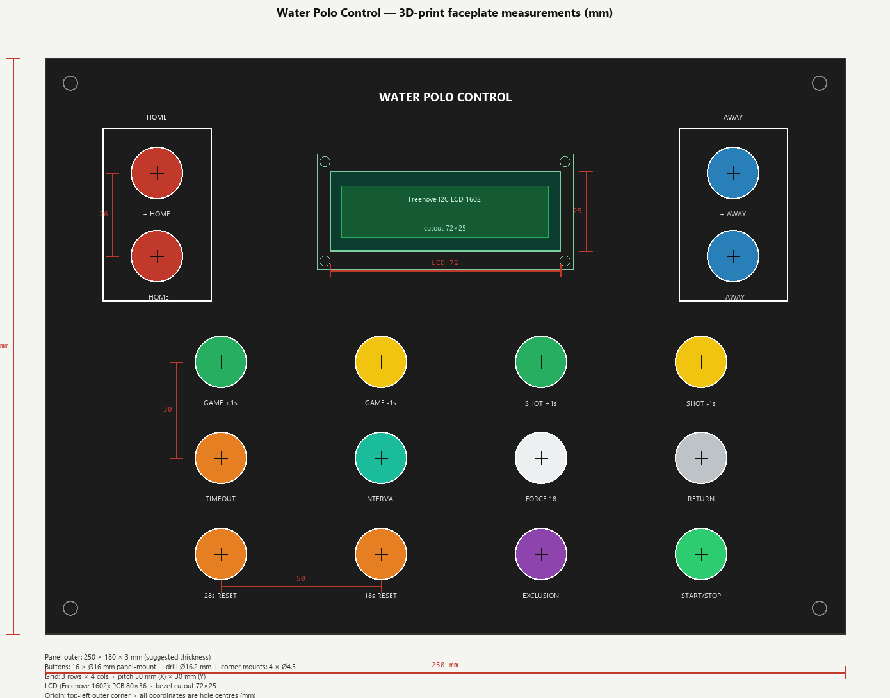
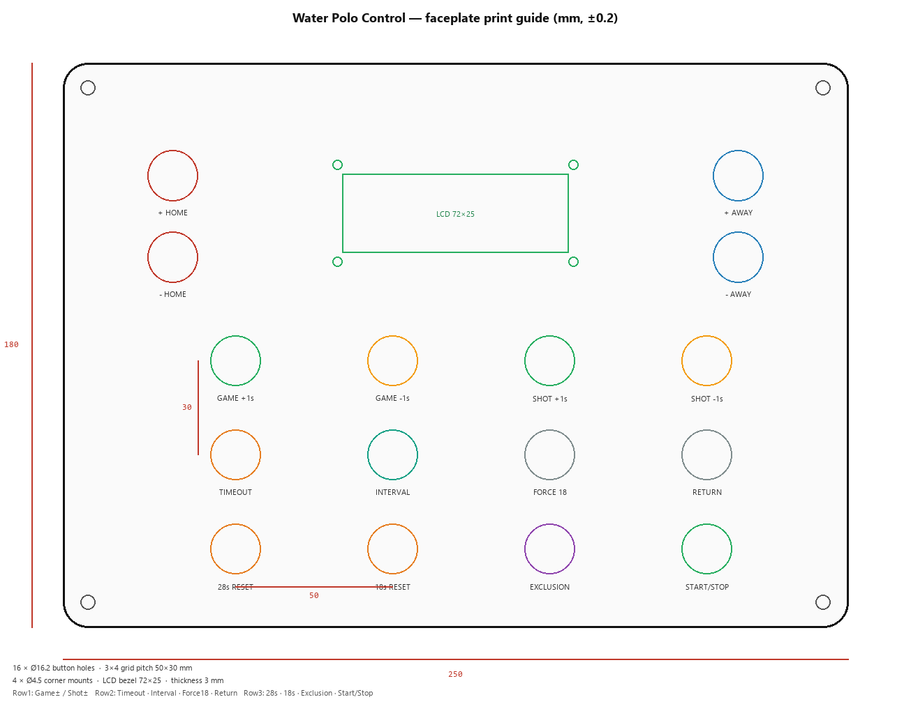

# Button-box faceplate — 3D print measurements

Dimensioned layout for a printable / CNC / laser faceplate matching [`button_box_panel.png`](button_box_panel.png).



Print guide overview:



Vector (1:1 mm): [`button_box_panel_dimensions.svg`](button_box_panel_dimensions.svg)

## Layout (below LCD)

Three rows of four buttons (left → right):

| Row | Buttons |
|-----|---------|
| 1 | Game Clock **+1s** · Game Clock **−1s** · Shot Clock **+1s** · Shot Clock **−1s** |
| 2 | **TIMEOUT** · **INTERVAL** · **FORCE 18** · **RETURN** |
| 3 | **28s RESET** · **18s RESET** · **EXCLUSION** · **START/STOP** |

HOME / AWAY score buttons and the Freenove LCD stay in the top band.

## 3D print files

| File | Format | Notes |
|------|--------|-------|
| [`button_box_panel_faceplate.stl`](button_box_panel_faceplate.stl) | STL | Ready for slicer (Cura / PrusaSlicer / Bambu) |
| [`button_box_panel_faceplate.obj`](button_box_panel_faceplate.obj) | OBJ | Same geometry |

Regenerate mesh:

```bash
python docs/generate_panel_stl.py
```

Print flat on the bed, **3 mm** thick, no supports. Ream button holes to Ø16.2 if the slicer shrinks circles.

## Design basis

| Item | Spec |
|------|------|
| Momentary buttons | **Ø16 mm** panel-mount (**16** pcs) |
| Button panel holes | **Ø16.2 mm** (0.2 mm clearance) |
| Display | **Freenove I2C IIC LCD 1602** (FNK0079) |
| Faceplate outer | **250 × 180 mm**, corner R **8** |
| Suggested thickness | **3 mm** (PLA/PETG); leave ≥18 mm depth behind for LCD + I2C backpack |
| Grid pitch | **50 mm** (X) × **30 mm** (Y) |
| Coordinate origin | Outer **top-left** corner of panel |

## Freenove LCD 1602 cutout

Classic I2C 1602 module (Freenove FNK0079 class):

| Feature | Size (mm) |
|---------|-----------|
| PCB outline (behind panel) | 80 × 36 |
| **Front bezel cutout** (through faceplate) | **72 × 25** |
| Viewing area (reference) | 64.5 × 16.0 |
| Mounting-hole centres | **75 × 31** |
| Mounting-hole drill | Ø3.2 (M3 clear) |
| Module centre on panel | (125, 48) |
| Bezel cutout top-left | (89.0, 35.5) |

> Measure your module before final print: some Freenove boards are ~80×36, others closer to ~86×36. Adjust the bezel cutout if your metal frame differs; keep the **75×31** mount pattern unless your PCB says otherwise.

## Hole centre table (mm)

| Control | X | Y | Hole |
|---------|--:|--:|------|
| + HOME | 35.0 | 36.0 | Ø16.2 |
| - HOME | 35.0 | 62.0 | Ø16.2 |
| + AWAY | 215.0 | 36.0 | Ø16.2 |
| - AWAY | 215.0 | 62.0 | Ø16.2 |
| GAME +1s | 55.0 | 95.0 | Ø16.2 |
| GAME -1s | 105.0 | 95.0 | Ø16.2 |
| SHOT +1s | 155.0 | 95.0 | Ø16.2 |
| SHOT -1s | 205.0 | 95.0 | Ø16.2 |
| TIMEOUT | 55.0 | 125.0 | Ø16.2 |
| INTERVAL | 105.0 | 125.0 | Ø16.2 |
| FORCE 18 | 155.0 | 125.0 | Ø16.2 |
| RETURN | 205.0 | 125.0 | Ø16.2 |
| 28s RESET | 55.0 | 155.0 | Ø16.2 |
| 18s RESET | 105.0 | 155.0 | Ø16.2 |
| EXCLUSION | 155.0 | 155.0 | Ø16.2 |
| START/STOP | 205.0 | 155.0 | Ø16.2 |
| LCD mount 1 | 87.5 | 32.5 | Ø3.2 |
| LCD mount 2 | 162.5 | 32.5 | Ø3.2 |
| LCD mount 3 | 87.5 | 63.5 | Ø3.2 |
| LCD mount 4 | 162.5 | 63.5 | Ø3.2 |
| Panel screw 1 | 8.0 | 8.0 | Ø4.5 |
| Panel screw 2 | 242.0 | 8.0 | Ø4.5 |
| Panel screw 3 | 8.0 | 172.0 | Ø4.5 |
| Panel screw 4 | 242.0 | 172.0 | Ø4.5 |

## Useful pitches (centre-to-centre)

| Pair | Pitch |
|------|------:|
| HOME + to − (vertical) | 26 mm |
| AWAY + to − (vertical) | 26 mm |
| Grid columns (adjacent) | 50 mm |
| Grid rows (adjacent) | 30 mm |

## 3D-print notes

1. Print faceplate face-up; use **0.2 mm** layer height for clean holes.
2. Drill/ream **all** button holes to **Ø16.2** after printing if your slicer undersizes circles (including START/STOP).
3. LCD sits from the **rear**; bezel shows through the 72×25 window; secure with 4× M3.
4. Labels can be engraved, vinyl, or a second printed legend layer.

## Regenerate drawings

```bash
python docs/generate_panel_dimensions.py
```
