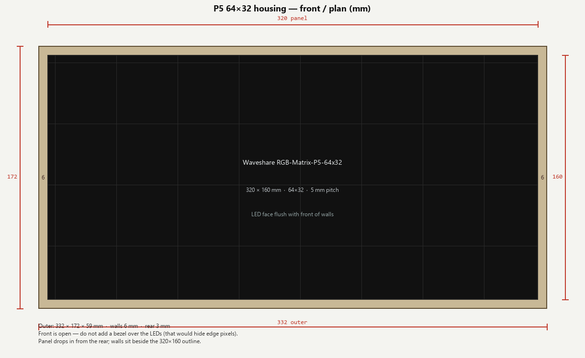
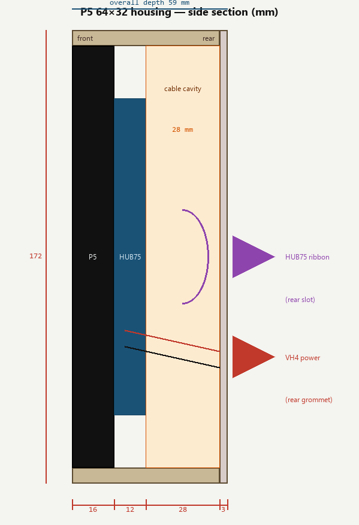
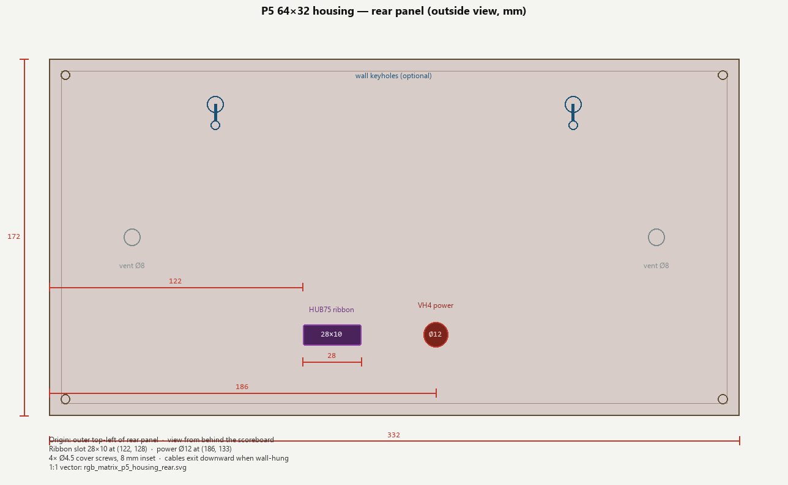

# P5 64×32 matrix housing — build template

Shallow rear box that holds a [Waveshare RGB-Matrix-P5-64x32](https://www.waveshare.com/rgb-matrix-p5-64x32.htm) (SKU **25848**) with a small cable cavity. The **HUB75 ribbon** and **VH4 power** leave through the **rear panel**. The LED face is the front of the assembly — do not put a bezel over the pixels.

This housing is for the **P5 320×160 mm** panel only. A P3 64×32 is 192×96 mm and will not fit.

Wiki: [RGB-Matrix-Px-64x32 (P5 variant)](https://docs.waveshare.com/RGB-Matrix-Px-64x32?variant=P5-64x32)

Related: [HUB75 wiring](rgb_matrix_mega_wiring.png) · [button-box faceplate](button_box_panel_measurements.md)







1:1 rear-panel vector (laser / CNC): [`rgb_matrix_p5_housing_rear.svg`](rgb_matrix_p5_housing_rear.svg)

Regenerate drawings:

```bash
python docs/generate_p5_housing.py
```

---

## What this box does

| Goal | How |
|------|-----|
| Hold the matrix | 6 mm walls around a **320 × 160 mm** rear-loading pocket. LED face flush with the front. |
| Stash cables | **28 mm** cavity behind the HUB75 sockets for a folded ~30 cm ribbon and the VH4 pigtail. |
| Rear access | Removable rear panel with a **ribbon slot** and a **power grommet**. PSU and Mega stay outside the box. |

The Mega, button box, and 5 V PSU are **not** inside this housing.

---

## Panel (confirm on the unit)

| Item | Spec |
|------|------|
| Part | Waveshare **RGB-Matrix-P5-64x32** |
| SKU | **25848** |
| Face size | **320 × 160 mm** (64×32 × 5 mm pitch) |
| Typical thickness (LED + PCB) | **~16 mm** — measure yours |
| Typical rear protrusion (HUB75 / ICs / magnets) | **~12 mm** — measure yours |
| Headers | HUB75 **IN** + **OUT**, **VH4** 5 V power |
| Supply | **5 V / 4 A** (≤20 W). Never from Mega 5 V. |
| Weight | 0.665 kg |
| In the box | 16-pin ribbon ~30 cm, power terminal adapter |

> **Measure before cutting.** Waveshare notes that back-side layout can differ between batches. Fill in the table below from *your* panel, then drill magnet / screw posts to match.

### Measure-your-panel checklist

Place the panel **face down**. Origin = PCB **top-left** as viewed from the rear (HUB75 labels readable).

| Feature | Measured (mm) |
|---------|---------------|
| Overall W × H | 320 × 160 (expect) · yours: ______ × ______ |
| LED + PCB thickness | ______ |
| Tallest rear part (socket / magnet) | ______ |
| HUB75 **IN** centre (X, Y) | ______ , ______ |
| VH4 power centre (X, Y) | ______ , ______ |
| Magnet / screw 1 (X, Y) | ______ , ______ |
| Magnet / screw 2 | ______ , ______ |
| Magnet / screw 3 | ______ , ______ |
| Magnet / screw 4 | ______ , ______ |
| Extra mounts (if any) | ______ |

Typical indoor P5 modules use **four corner magnets** about 8–12 mm in from each edge. Treat that only as a hint — drill from the measured centres.

---

## Housing dimensions (template)

Coordinate origin for the rear panel: **outer top-left**, Y down (same convention as the button-box faceplate).

| Item | Size (mm) |
|------|-----------|
| Outer W × H | **332 × 172** |
| Outer depth (front of walls to outside of rear) | **59** |
| Wall thickness | **6** (plywood / acrylic) |
| Inner pocket | **320 × 160** |
| Internal depth (front to inside of rear panel) | **56** |
| Rear panel | **332 × 172 × 3** |
| Cable cavity (behind connectors) | **28** |

Stack, front → back:

| Layer | Depth (mm) |
|-------|----------:|
| LED mask + PCB | 16 |
| HUB75 / ICs | 12 |
| Cable service loop | 28 |
| Rear panel | 3 |
| **Total** | **59** |

If your panel + sockets are thicker than 28 mm combined, add that extra to the side-wall depth so the **28 mm cavity** stays free.

---

## Cut list (6 mm plywood, 3 mm rear)

Butt joints: top and bottom run the full **332 mm** width; left and right sit between them so the inner height is **160 mm**.

| Part | Qty | Cut size (mm) | Material |
|------|----:|---------------|----------|
| Top | 1 | **332 × 56** | 6 mm ply |
| Bottom | 1 | **332 × 56** | 6 mm ply |
| Left | 1 | **160 × 56** | 6 mm ply |
| Right | 1 | **160 × 56** | 6 mm ply |
| Rear panel | 1 | **332 × 172** | 3 mm ply / acrylic |
| Corner clips / magnet posts | 4 | see assembly | 3D-print, aluminium angle, or panel magnets |

Side-wall depth **56 mm** is the *internal* cavity (panel + sockets + cables). Glue the **3 mm** rear onto the back of those walls (overall depth 59 mm), or recess it 3 mm if you want a flush back.

**Acrylic / laser:** same outer sizes; 3 mm sides are too flexible at this span — use 5–6 mm or add a mid-span rib on the long edges.

**3D print:** 332 mm exceeds many beds. Print as four walls + rear, or split the shell on the vertical centreline with alignment pins.

---

## Rear panel — hole table (mm)

Outside view, looking at the back of the scoreboard. Cables drop **down** when the box is wall-hung.

| Feature | X | Y | Cut |
|---------|--:|--:|-----|
| HUB75 ribbon slot (top-left of slot) | 122.0 | 128.0 | **28 × 10**, R2 corners |
| VH4 power grommet (centre) | 186.0 | 133.0 | **Ø12** |
| Vent left (centre) | 40.0 | 86.0 | Ø8 |
| Vent right (centre) | 292.0 | 86.0 | Ø8 |
| Cover screw 1 | 8.0 | 8.0 | Ø4.5 (M4 clear) |
| Cover screw 2 | 324.0 | 8.0 | Ø4.5 |
| Cover screw 3 | 8.0 | 164.0 | Ø4.5 |
| Cover screw 4 | 324.0 | 164.0 | Ø4.5 |
| Wall keyhole L (head centre) | 80.0 | 22.0 | Ø8 head, Ø4.5 neck, 10 mm drop |
| Wall keyhole R | 252.0 | 22.0 | same |

If HUB75 **IN** on your panel is far from the slot, keep the slot where it is and use the 28 mm cavity as slack — the included ribbon is ~30 cm. Do **not** put a tight 90° fold against the IDC strain relief.

Fit a rubber grommet in the Ø12 power hole so the VH4 jacket is not cut by the panel edge.

---

## How the panel is held

The 320 × 160 outline has **no extra flange**. Walls sit *beside* the panel, not in front of it.

1. Build the four-sided shell (no front skin).
2. From the **rear**, slide the panel in until the LED face is flush with the front of the walls.
3. Stop it from falling back with **one** of:
   - the panel’s own **magnetic posts** landing on steel discs glued to the inner rear face of the side walls / a thin internal keeper
   - four **M3/M4** posts through the panel’s corner holes into printed or wooden blocks
   - short aluminium-angle clips on the four inner corners, behind the PCB
4. Dress ribbon + power in the cavity, then fit the rear panel.

Do not sandwich the HUB75 sockets against the rear panel — leave the 28 mm loop.

---

## Assembly order

1. Cut and dry-fit the four walls. Inner opening must accept **320 × 160** with ~0.5 mm total clearance (aim **320.5 × 160.5** if the plywood is proud).
2. Glue / screw the shell square. Sand the front edges flush.
3. Cut the rear panel (use the SVG). Test-fit ribbon and power through the openings *before* mounting the matrix.
4. Fit retention clips or magnet landing pads.
5. Power **off**. Plug VH4 into the panel, route the pigtail through the grommet (leave ~80 mm slack inside).
6. Plug HUB75 **IN**, fold the ribbon once in the cavity, feed the free end through the slot.
7. Seat the panel flush, fit the rear panel with 4× M4.
8. Tie common **GND** with the Mega / PSU outside the box. Power the matrix from the **external 5 V** supply only.

Paint / stain after a dry assembly so finish does not bind the panel in the pocket.

---

## Materials (typical)

| Qty | Item |
|----:|------|
| — | 6 mm plywood or MDF for the shell |
| 1 | 3 mm plywood or acrylic for the rear panel |
| 4 | M4 × 16 mm screws + inserts (rear cover) |
| 1 | Ø12 mm rubber grommet (power) |
| 4 | Magnet landing discs or M3/M4 posts (panel retain) |
| — | Wood glue, 20 mm pins or pocket screws |
| optional | 2× wall screws for the keyholes |

---

## Notes

- **Ventilation:** the panel can draw up to ~20 W. Keep the two Ø8 vents; do not seal the ribbon slot.
- **No front bezel** over the LEDs — a 1 mm lip already eats edge pixels.
- Ribbon pin 1 (brown) still follows the [HUB75 colour matrix](hub75_ribbon_colour_matrix.png) once it reaches the Mega.
- This box does not replace strain relief at the Mega end — clamp the ribbon there as well.
- For a desk stand, skip the keyholes and add two rear feet so the cable exits stay clear of the table.

## Record (fill when built)

| Field | Value |
|-------|-------|
| Date | |
| Material / finish | |
| Measured panel thickness | |
| Magnet / screw pattern used | |
| Notes | |
